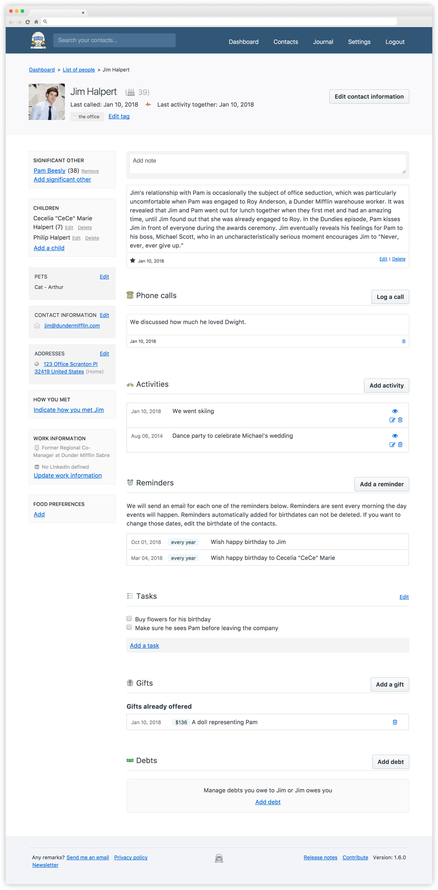

<!--
N.B.: This README was automatically generated by https://github.com/YunoHost/apps/tree/master/tools/README-generator
It shall NOT be edited by hand.
-->

# Monica pour YunoHost

[](https://dash.yunohost.org/appci/app/monica)    
[](https://install-app.yunohost.org/?app=monica)

*[Read this readme in english.](./README.md)*

> *Ce package vous permet d'installer Monica rapidement et simplement sur un serveur YunoHost.
Si vous n'avez pas YunoHost, regardez [ici](https://yunohost.org/#/install) pour savoir comment l'installer et en profiter.*

## Vue d'ensemble

Monica is an open-source web application to organize the interactions with your loved ones. I call it a PRM, or Personal Relationship Management. Think of it as a [CRM](https://en.wikipedia.org/wiki/Customer_relationship_management) (a popular tool used by sales teams in the corporate world) for your friends or family.


**Version incluse :** 3.7.0~ynh1

## Captures d'écran



## Avertissements / informations importantes

* You can connect using the email address of the user choosen during the installation and password provided during the installation
* New registrations are disabled, you can open the register for all by changing the value **APP_DISABLE_SIGNUP** to **false** in **.env**.
* There is **no admin interface** in the Monica app currently.

## :red_circle: Fonctions indésirables

- **Package not maintained**: This YunoHost package is not maintained and needs adoption.

## Documentations et ressources

* Site officiel de l'app : <https://monicahq.com>
* Dépôt de code officiel de l'app : <https://github.com/monicahq/monica>
* Documentation YunoHost pour cette app : <https://yunohost.org/app_monica>
* Signaler un bug : <https://github.com/YunoHost-Apps/monica_ynh/issues>

## Informations pour les développeurs

Merci de faire vos pull request sur la [branche testing](https://github.com/YunoHost-Apps/monica_ynh/tree/testing).

Pour essayer la branche testing, procédez comme suit.

``` bash
sudo yunohost app install https://github.com/YunoHost-Apps/monica_ynh/tree/testing --debug
ou
sudo yunohost app upgrade monica -u https://github.com/YunoHost-Apps/monica_ynh/tree/testing --debug
```

**Plus d'infos sur le packaging d'applications :** <https://yunohost.org/packaging_apps>
